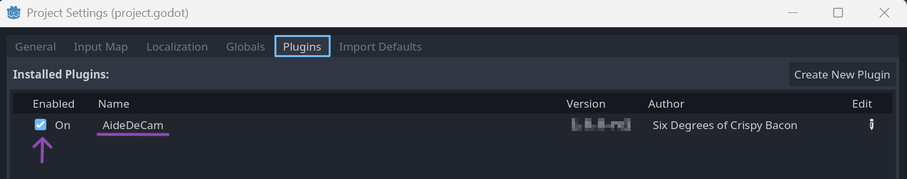
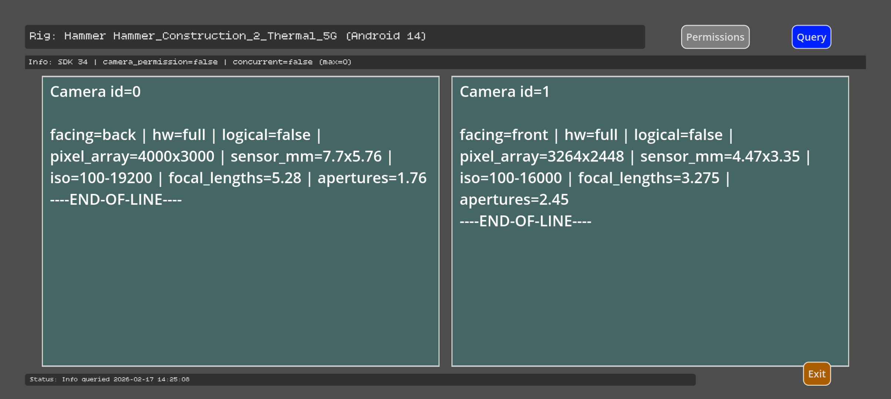
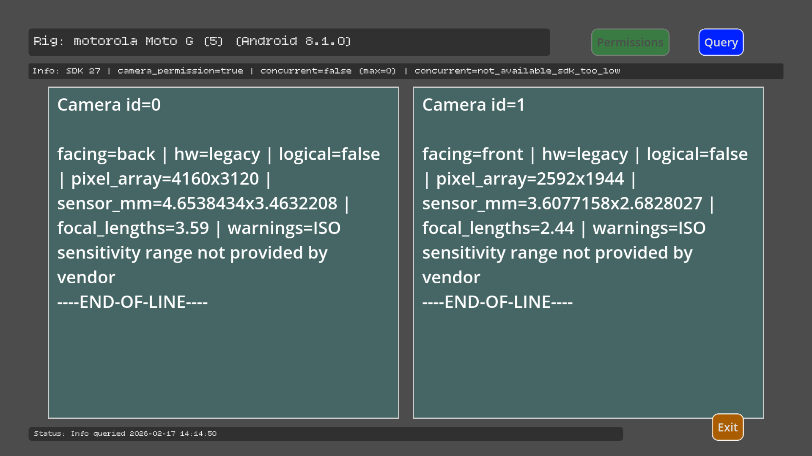
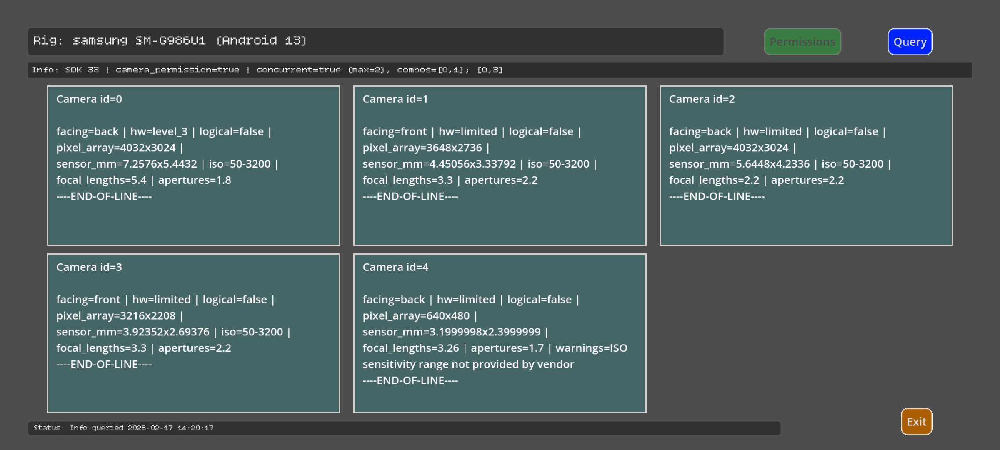
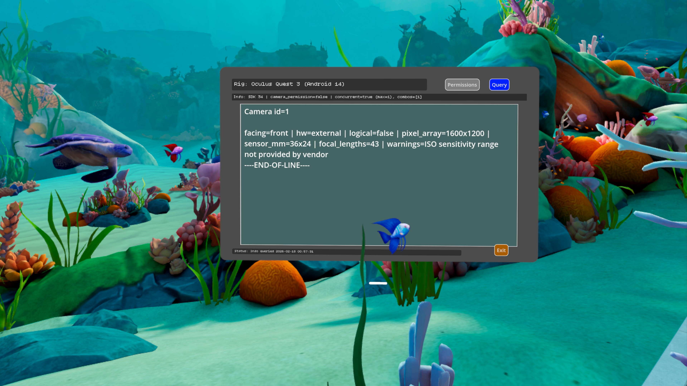
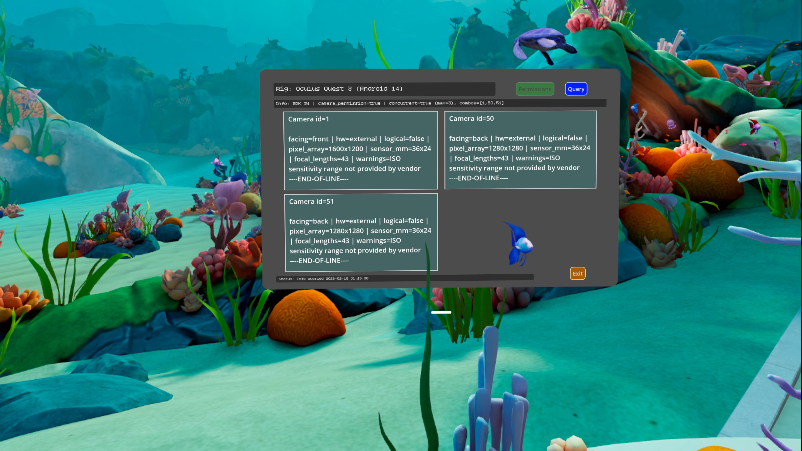
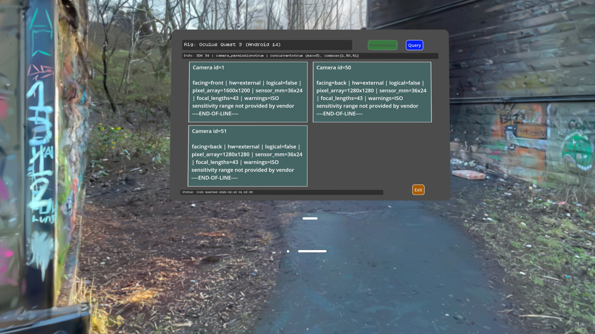

# Aide-De-Cam

## A Godot Android[^camera2] Plugin which reports on camera 'capabilities'.  
[^camera2]:*Leveraging Camera2, so Android-only.*

## Requirements
- **Godot 4.3 or higher**
- Android API 21+ (Android 5.0 Lollipop or higher)

## Compatibility
- Built against: Godot 4.3
- Tested with: Godot 4.3, 4.4, 4.5, 4.6
- Should work with future Godot 4.x releases

### How to use:

Check the plugin is ready 
```
# Check the plugin is ready
if AideDeCam.is_plugin_available():
	
	# Get capabilities: saves camera_capabilities.json to user dir, returns JSON string.
	var capabilities_json = AideDeCam.get_camera_capabilities()
		
	# As per above, but also saves to Documents/<project-name>/<dir>/camera_capabilities_{timestamp}.json
	var capabilities_with_docs = AideDeCam.get_camera_capabilities_to_file("dir")
		
else:
	print("Plugin not available - are you running on Android?")
```

### Output:
SDK Version:  
Always included in output, with minimum SDK check (21 for Camera2)  

Concurrent Camera Support:  
Reports which camera combinations can be used simultaneously (Android 11+)
Shows max concurrent cameras and valid combinations

Vendor Implementation Validation:  
Validates all numeric values (sizes, ISO, focal lengths, FPS)
Collects warnings for missing or invalid vendor data
Per-camera warnings array + global warnings summary

Logical Multi-Camera:  
Detects multi-lens setups with sync type info. Well... it *Should*. Currently untested as [@The-Cyber-Captain](https://github.com/The-Cyber-Captain) has no such hardware.

Full schema? See: aidedecam-camera-capabilities-v1.schema.md 

### Installation

#### Release:

- Download the Release [TODO]: "or grab it from the [Godot Asset Library](https://godotengine.org/asset-library/asset)"  
- Drop aide_de_cam/ into addons/  
- Enable addon in Godot  

    Project -> Project Settings -> Plugins -> AideDeCam :ballot_box_with_check: 
<!-- RELEASE:EXCLUDE:BEGIN -->

<!-- RELEASE:EXCLUDE:END -->

- Profit?

NOTE: Enabling the plugin adds an AideDeCam autoload into the scene. Don't panic; it's just a practical way of providing:
- autocompletion
- F1 help
- an API
.. for the behind-the-scenes singleton Object the JNI / Kotlin AAR has to provide.
  
#### Building from source:

Sure, why not? Enjoy. 😉  
See: docs/HOWTO-build_draft.txt

### Demo

- Open the demo project, demos/aidedecamdemo.
- Install Aide-De-Cam.
- Create an Android export preset;  
  * Add Camera permissions for full functionality.  
  * Set adaptive foreground icon (branding/android_adaptive_icon.png) for maximum pretty.  
- Plug in a suitable device.
- One-touch deploy.


<!-- RELEASE:EXCLUDE:BEGIN -->
- Screenshots:
  
  
  
Quest3: Avatar only  
  
Quest3: Camera permissions requested  
  
  
<!-- RELEASE:EXCLUDE:END -->

### Licensing
Code: The Unlicense  

Build tooling: Gradle Wrapper (Apache-2.0)[^third-party]  

Fonts: Bitcount_Single (SIL Open Font License-1.1)[^third-party]
[^third-party]:*See `THIRD_PARTY_NOTICES.md`*  

### Support me! 🥛🍞

[](https://ko-fi.com/L4L81SGS9W)
